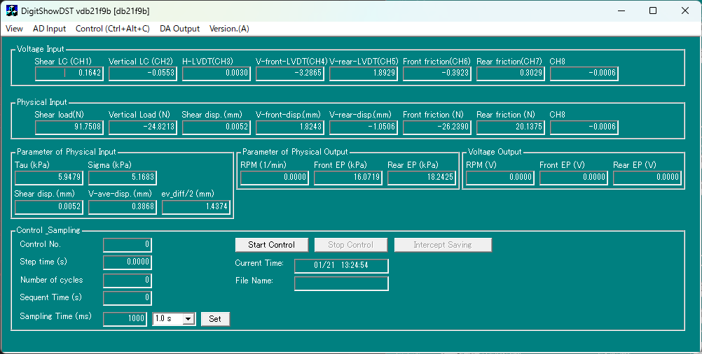

# DigitShowDST

  [](http://makeapullrequest.com)




## 簡単な説明
[mkt-kuno/DigitShowBasic](https://github.com/mkt-kuno/DigitShowBasic)をベースに、ClaudeやGPTとリファクタリング・機能追加を行った一面せん断試験機制御ソフトウェアです。

変更点：
- UI/UX
  - 不要なダイアログをばっさり削る
  - キーボードショートカット対応 (一部のみ)
  - キャリブレーションファイルとコントロールファイルの書式改善
    - 謎の拡張子を廃止し、json/yamlベースに移行
    - パラメタ名を`CFPARA[...]`みたいな謎の名前から`target_sigma_kPa`のような可読性の高い名前に変更
    - コントロールパターンもID指定から名前指定に変更
  - ロギング形式の改善
    - 謎拡張子からUTF-8 TSVに変更
    - 時間を経過時間からUNIX時間に変更
    - 定期的にフラッシュするようにして、異常終了時のデータ損失を軽減するとともに、制御を止めずにデータ分析できるように改善
- コードの大幅リファクタリング
  - C++26ベースで書き直し
  - グローバル変数のスコープを限定
    - 排除まではまだできてない
  - UTF-8対応
  - `std::atomic`によるマルチスレッド対応 (......はまだ中途半端)
- 機能追加
  - REST APIサーバー機能追加
    - FrontendをReactとかでサッと作って、リアルタイムでセンサーデータをグラフ化したりできる
    - 今のところはphyoutとparameterの配信のみ、今後制御コマンドも追加予定

ベースとは言っていますが内部構造はほぼ別物になっています。変数名に多少名残があるくらいです。
本当は汎用的に作り直したかったのですが、時間と労力の関係で一面せん断試験機に特化した形になっています。
卒論終わったら多少堅牢に作り直したいですが、もうMFCと付き合うのは勘弁なので放置するかもしれません。

本家同様、ContecのAD/DAボードで動作させることを前提としています。
このリポジトリのライセンスは **GPLv3** となっているため、注意してください。

以下、fork元のREADMEをベースに加筆修正しています。

## 動作環境
- Windows 11
  - x64のみ, ARM64不可
  - Win32ビルドも可能ですが、実機テストはx64しかしていません。
- Visual Studio 2026
  - Community版やBuild ToolsでOK
- CONTEC API-AIO(WDM) Ver.8.90
  - 適宜、CAIO.H, CAIO.LIBを置き換えて使用するDLLバージョン一致させれば最新版でも可。
- CPU: x64 Intel/AMD問わず
  - [Passmark性能(マルチスレッド)](https://www.cpubenchmark.net/multithread/) 最低5000 推奨8000以上
- RAM: 最低4GB 推奨8GB以上
  - 他に動かすアプリケーション次第。MS Officeは重い。
- GPU: 依存なし、iGPU/dGPU/APU いずれも可
  - 液晶: 最低HD 推奨FHD以上
  - 縦長画面だと表示が見切れると思います。
- 記憶媒体: 最低HDD 推奨SSD
  - 容量はビルドPCと動作PCが同じなら最低128GB 推奨256GB

本家と違ってヘッダーファイルを量産しまくったので、ビルド時間がかなり長いです。
CPUとRAMはそれなりに積んだほうが良いです。8GBは結構きつい。
本当はC++ Modulesを使いたいのですが、Visual Studio CodeのC++ Modulesサポートがまだ不安定なので見送りました。

## Getting Started

GitHub Releasesからexeファイルをダウンロードして実行してください。
CONTECのversionを変えたい場合は、各自でビルドしてください。

## Notice
- 本ソフトウェアの動作について、一切の保証を行いません。
- 本ソフトウェアの使用により発生したいかなる損害についても、一切の責任を負いません。
- 本ソフトウェアを使用する場合は、自己責任で行ってください。
- 本ソフトウェアの動作または初期設定についてのサポートは行いません。
- 本ソフトウェアの改変、再配布はGPLv3の条件に従って行ってください。

## Build instructions

### Prequisites

- Visual Studio 2026

  Community版またはBuild Toolsをインストールしてください。
  以下のコマンドをPowerShellで実行すると、必要なコンポーネントがインストールされます。
  - Build Toolsの場合:
    ```powershell
    winget install Microsoft.VisualStudio.BuildTools --override "--passive --add Microsoft.VisualStudio.Workload.VCTools --add Microsoft.VisualStudio.Component.VC.ATL --add Microsoft.VisualStudio.Component.VC.ATLMFC --add Microsoft.VisualStudio.Component.VC.CLI.Support --add Microsoft.VisualStudio.Component.VC.Llvm.Clang --add Microsoft.VisualStudio.Component.VC.Llvm.ClangToolset --includeRecommended"
    ```
  - Community版の場合:
    ```powershell
    winget install Microsoft.VisualStudio.Community --override "--passive --add Microsoft.VisualStudio.Workload.VCTools --add Microsoft.VisualStudio.Component.VC.ATL --add Microsoft.VisualStudio.Component.VC.ATLMFC --add Microsoft.VisualStudio.Component.VC.CLI.Support --add Microsoft.VisualStudio.Component.VC.Llvm.Clang --add Microsoft.VisualStudio.Component.VC.Llvm.ClangToolset --includeRecommended"
    ```
  すでにVisual Studioをインストールしている場合は、このコマンドを実行してもworkloadが追加されないので、Visual Studio Installerから手動で追加してください。

  ClではなくLLVM/Clangを使っているのは趣味です。MFCなんて化石技術でもClangでコンパイルできるんですね。本当はMSBuildもCMakeに変えたかったのですが、リンカー回りの問題が解決できず断念しました。

- Visual Studio Code (推奨)

  Visual Studio重すぎて嫌なので、VS Codeでビルド・デバッグしてます。
  え？リソースファイルの編集？**手　書　き**ですがなにか？

  大丈夫大丈夫、~~洗脳されると~~慣れるとリソースエディタを使うより手書きのほうが楽になりますよ。

  もちろん、Visual Studioのリソースエディタでも編集できます。ただし、おそらく文字コードの問題で、Visual Studioで保存すると日本語コメントが文字化けします。そこだけ注意。

### Build Steps

#### 1. Clone the repository

Gitコマンド必須です。Gitの説明はしないので自分で調べてください。

[vcpkg](https://vcpkg.io/)をサブモジュールとして使っているので、以下のように`--recurse-submodules`オプションを付けてクローンしてください。

```powershell
git clone --recurse-submodules {$repo_url}
```

または以下のように後からサブモジュールを初期化してもOKです。

```powershell
git clone {$repo_url}
cd DigitShowDST
git submodule update --init --recursive
```

そのあとお好みのエディタ(Visual Studio, VS Code, Windows Terminal など)で開いてください。

#### 3. `.env` ファイルを作成

`.env.example` をコピーして `.env` を作成し、Visual Studio のインストールパスを指定します:

```powershell
# リポジトリルートで実行
Copy-Item .env.example .env

# エディターで .env を開き、VS_INSTALL_PATH を編集
# 例: C:\Program Files\Microsoft Visual Studio\18\Community
```

**`.env` 例:**
```
VS_INSTALL_PATH=C:\Program Files\Microsoft Visual Studio\18\Community
```

なんでこんな作業が必要かというと、MSBuildのパスが環境によって異なるためです。
環境変数などで特定する方法もMicrosoftは提供していないため、仕方なく手動で指定してもらう形にしています。文句はMicrosoftに言ってください。これでもかなりマシな方法です。

(推測するに、一つのマシンに複数のVisual Studioバージョンがインストールされている場合があり、環境変数で一意に特定できないためだと思います。でもそれならnvmみたいなバージョン管理ツール作ってほしい......)

#### 3. Build

MSBuildを使ってビルドします。
vcpkgの設定はビルド時に自動で行われます。

ビルド構成はRlease/Debug, x64/Win32の組み合わせを用意しています。
ただし、Debugビルドはリンカが配置newの重複シンボル警告を出すほか、文字化けするバグがあるため、あまり推奨しません。

Win32ビルドの場合は、`caio_x86.lib`が必要です。repoには含めていないので、各自CONTECの会員になって入手してください。

##### via VS Code

VS Code を開き、`Ctrl+Shift+B` を押して Build タスクを実行します:

- **MSBuild: Build Release**
- **MSBuild: Build Debug**
- **MSBuild: Build Release x64** (デフォルト)
- **MSBuild: Build Debug x64**
- **MSBuild: Clean Release** / **Clean Debug**

##### via Visual Studio

**知らん**

まあたぶん `ファイル > 開く > プロジェクト/ソリューション` で `DigitShowDST.vcxproj` を開いて、`ビルド > ソリューションのビルド` でいけると思います。

##### via PowerShell

`Load-DevEnv.ps1` スクリプトで`.env`などを設定してから MSBuild を実行します:

```powershell
# 環境をロード（.env から読み込み）
. .\scripts\Load-DevEnv.ps1

# ビルド実行
msbuild .\DigitShowDST.vcxproj -t:Build -p:Configuration=Release -p:Platform=x64
msbuild .\DigitShowDST.vcxproj -t:Build -p:Configuration=Debug -p:Platform=x64
```

## ライセンスについて
(以下、original READMEママ)

> 一部の大学・企業・研究所では秘伝のタレ状態のDigitShowBasicをお持ちだと思います。
当時(2010年頃)配布されたDigitShowBasicのソースコードは何もライセンスが決められていませんでした。
そのため、お持ちの古いDigitShowBasicは高確率でライセンスフリーのハズです。
ですが、このリポジトリはGPLv3です。このコードを安易に参考・参照・引用した場合GPLv3に感染するので、
GPLv3とは何か知ったうえで、覚悟して使い始めてください。
ざっくりといえば、改変部分がある場合、ソースコードを公開する必要があります。

(ここまで)


## リポジトリの運用方針について

今のところ、以下の3つのブランチで運用しています。

```
GitHub - takker99/DigitShowDST
├── main (upstream同期, 将来の公式リリース基盤)
├── dst  (commit履歴整理用, 後々カプセル化・リファクタリング)
└── dst-temp (デフォルト, 即座の公開版, 開発フロー用)
```

コードを読めば察しが付くかもしれませんが、dst-tempブランチは[mkt-kuno/DigitShowBasic](https://github.com/mkt-kuno/DigitShowBasic)からcommitを積み上げて作ったのではなく、東京理科大学の地盤研で使っていた秘伝のタレDigitShowBasicを魔改造して作ったものです。本来ならそちらを公開すべきなのですが、ライセンスが不明瞭なため、mkt-kunoさんのOSS版DigitShowBasicをベースに作り直す形にしました。

卒論締め切りまで時間が無いため、公開して卒論で参照できる状態を最優先し、private repoで開発していたDgitShowDSTをハードコピーしたのがdst-tempブランチです。
厳密にはOSS版を改変したものではないので公開していいか怪しいところが若干ありますが......まあたぶん大丈夫でしょう。怒られたら消します。

dst-tempはcommit履歴がなく、どのよう変更を積み上げたか分からないため、将来的にはdstブランチでcommit履歴を整理していくつもりです (余裕があればだけど......)。
ある程度形になったらdstブランチをdefaultに切り替えます。

またDigitShowDSTで加えた機能や修正をmkt-kuno/DigitShowBasicに還元することも考えています。その際はmainブランチをベースにPull Requestを送ります。

## バグ報告やPull Requestについて

本家同様、「初期設定や困った部分を文章化したので載せてほしい」「AIOボードの初期化を自動にしたコードをマージしてほしい」など、貢献する意思のある、オープンソースの理念に沿った要求は大歓迎します。

注意点など
- Pull Requestを送る場合は、簡単で良いので動作確認を行い、変更点を記載してください。
- AIによるVibe codingを禁止しませんが、推奨もしません。
- バグなどのIssueを送る場合は、必ず考えつく限り詳細な、問題を再現するのに必要な情報を提供してください。
- commitは何となく変更点が分かればいいです。コメントの書き方も自由で良いです。日本語でもOKです。
  - 一応、Conventional Commitsで英語で書くのが望ましいですが、強制しません。
  - てかCoding Agentも時々守ってくれないし......。

「根幹設計から新しいの作りたい」というやる気とコーディング能力のある方は、
[ぜひこちら](https://github.com/mkt-kuno/DSMng)、もしくは東大地盤研か@takker99 までご連絡を。

## Acknowledgements

DigitShowBasicは、国立研究開発法人 土木研究所で作成されたDigitShowを参考に、東京大学 本郷地盤研の本田剛さんが開発され、その後、桑野研究室の@mkt-kuno さんによりOSS化されました。
ここに改めて感謝申し上げます。

(ref. [DigitShowBasic オープンソース版 - 桑野研究室 Kuwano Lab. IIS, The Univ of Tokyo](https://geo.iis.u-tokyo.ac.jp/archives/7629))
